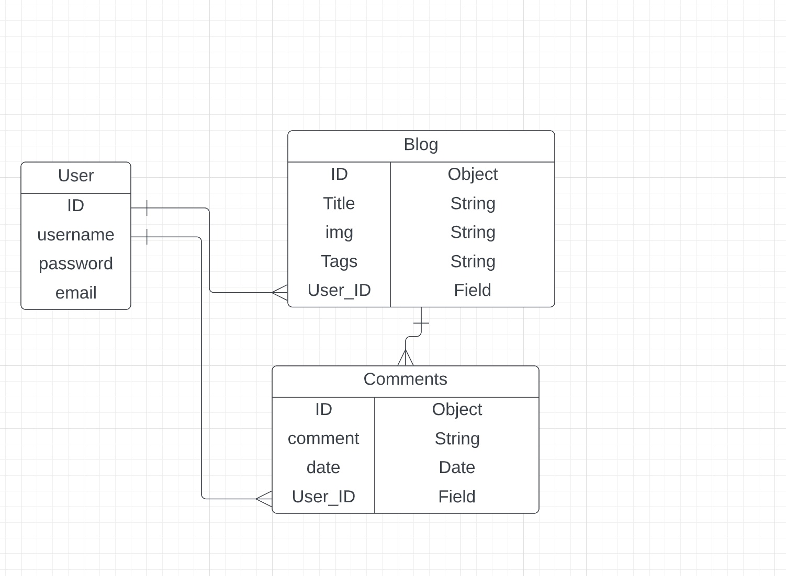

# Blogger

# Product Requirements Documentation

**Summary**

| Field | Detail |
|--------|-----|
| Project Name | Blogger |
| Description | A website where users can read articles posted by our community members. |
| Developers | Jonathan Pierre |
| Live Website | N/A|
| Repo | https://github.com/JPierre23/Blogger |
| Trello Board | https://trello.com/b/MUa4GM5I/blogger |

## Technologies Used
-HTML5
-CSS3
-JavaScript
-JQuery

## Problem Being Solved and Target Market
Any genre of any television show users can now add that hero to our bank of heroes

## User Stories
- Users should be able to access the site
- As a user I should be able to signup / login to my created account
- As a user I should only be able to Create, Edit, Delete my own blogs.
- As a user I should be able to view Blogs created by other users.
- As a user I should be able to leave comments on blogs.
- As a user I should be able to easily navigate through the website.

## Screenshots

## Future Enhancements
- Chat Bot
- Verified Users
- Categorize articles